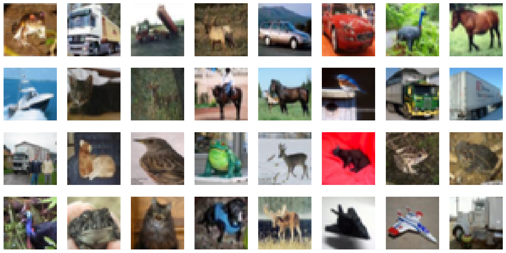

# Image Classification

## Model Structure

The model architecture is divided into Feature Extractor and Classifier.

### Input Image
The input to the network is Image of size **32 * 32** with color schemes (**RGB**)

### Feature Extractor
Feature Extractor is key commponent in CNN, that processes an input image to identify and extract meaningful features.
It consists of several layers, primarily involving Convolutional, Pooling layers and sometimes Normalization layers.
#### Concolutional Layers
- Applies filters to the input image to create feature maps
- Each filter detects different patterns such as Edges, Textures and more complex structures.

#### Pooling Layers
- Reduce the dimensionality of feature maps while retaining the essential information.
- Common types are Max Pooling & Average Pooling

### Normalization Layers
- Apply normalization techniques like Batch Normalization to stabilize & accelerate training.
